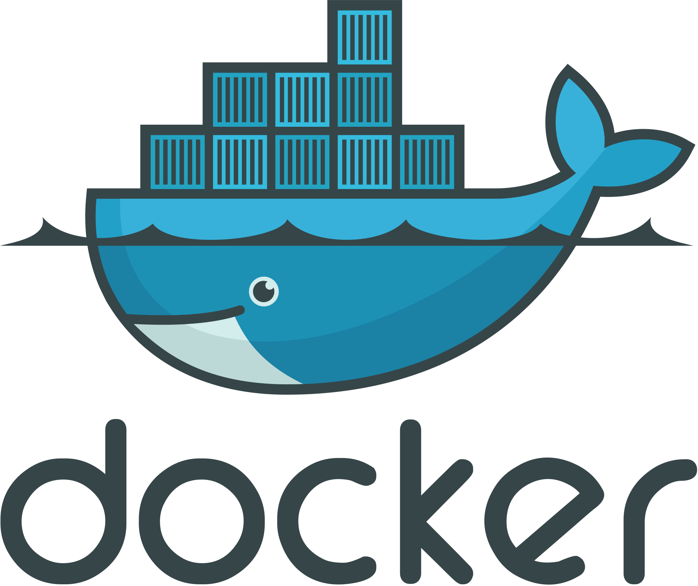
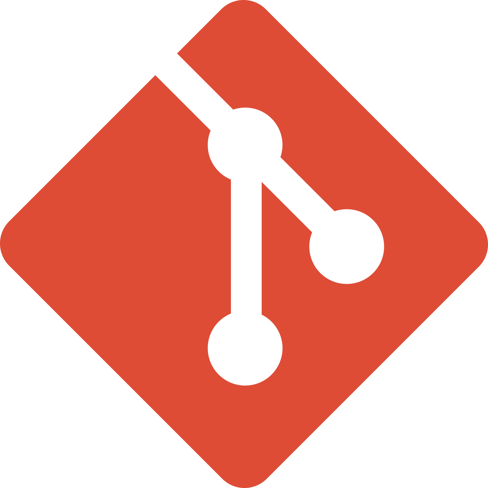
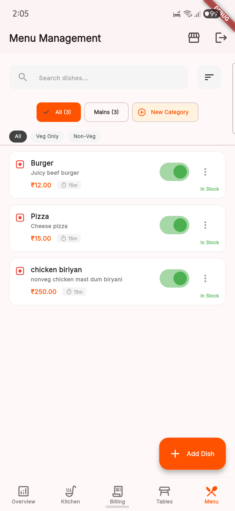
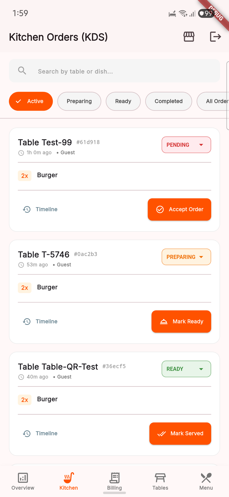
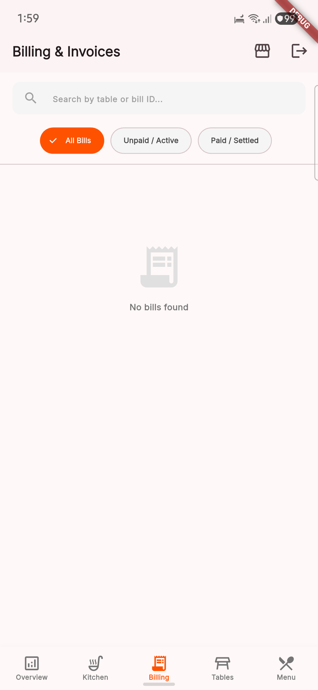
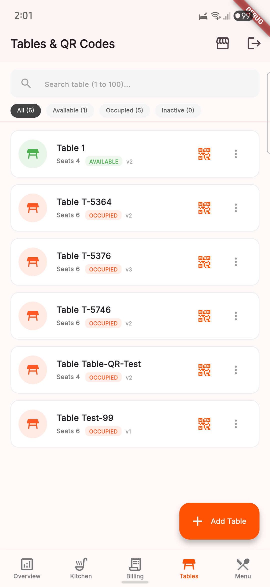
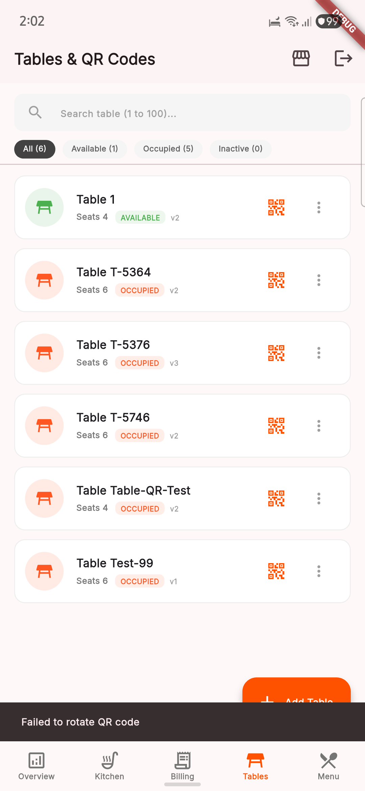

<div align="center">

  <!-- Interactive Hero Banner Linking to Live Web Experience -->
  <a href="https://aditya-err.github.io/FODQ-Partner/docs/experience/">
    
  </a>

  <br/><br/>

  <!-- Interactive Navigation Bar -->
  <p align="center">
    <a href="https://aditya-err.github.io/FODQ-Partner/docs/experience/">
      
    </a>
    <a href="#-the-diner-journey">
      
    </a>
    <a href="#-core-features--capabilities">
      
    </a>
    <a href="#-system-architecture">
      
    </a>
    <a href="#-built-with">
      
    </a>
    <a href="#-product-previews">
      
    </a>
    <a href="#-product-roadmap">
      
    </a>
  </p>

  <h3 align="center" style="font-weight: 500; color: #cbd5e1;">
    Digital dining, redesigned around the table.
  </h3>

  <p align="center">
    The cloud-native, QR-first operating system unifying table-side ordering, instant kitchen routing, authoritative billing, and real-time operator intelligence.
  </p>

  <br/>

  <!-- Primary Interactive Hero Call to Action -->
  <p align="center">
    <a href="https://aditya-err.github.io/FODQ-Partner/docs/experience/">
      
    </a>
    <br/>
    <sub>✨ Fully interactive static web app with clickable 9-stage diner journey, feature explorer & screenshot lightbox</sub>
  </p>

</div>


## ⚡ What is FODQ?

Traditional restaurant operations are plagued by friction: waiting for paper menus, waiting for waitstaff to record orders, transcription delays to the kitchen, and slow payment settlements.

**FODQ** transforms this paradigm by eliminating legacy operational bottlenecks:

* 📱 **Zero-Install Dining Ingress**: Diners scan a physical table QR code and immediately access an interactive, photo-rich menu directly in their mobile browser. No app store installation, no mandatory account sign-up.
* 👨‍🍳 **Synchronous Kitchen Routing**: Line cooks receive digitized orders on dedicated Kitchen Display System (KDS) stations the split-second customers submit their carts.
* 💳 **Authoritative Table Billing**: Real-time itemized tax computation, split-bill flexibility, seamless Razorpay payment capture, and automated digital receipts.
* 📊 **Operational Control**: Real-time floor occupancy maps, instant table status synchronization (`AVAILABLE` ➔ `OCCUPIED` ➔ `ORDERED` ➔ `BILLING`), and actionable revenue insights.

<div align="center">
  <a href="https://aditya-err.github.io/FODQ-Partner/docs/experience/#journey">
    
  </a>
</div>


## 🍽️ The Diner Journey

```
 [ Table Arrival ] ──► [ Scan Dynamic QR ] ──► [ Visual Interactive Menu ]
                                                            │
 [ Table Reset ]   ◄── [ Instant Settlement ] ◄── [ Real-Time KDS Prep ]
```

Click any step below to explore its role in the dining lifecycle:

<table>
  <tr align="center">
    <td width="16%">
      <a href="https://aditya-err.github.io/FODQ-Partner/docs/experience/#journey">
        <br/>
        <b>1. Scan QR</b><br/>
        <sub>Physical proximity validation</sub>
      </a>
    </td>
    <td width="16%">
      <a href="https://aditya-err.github.io/FODQ-Partner/docs/experience/#journey">
        <br/>
        <b>2. Discover Menu</b><br/>
        <sub>High-res food photography</sub>
      </a>
    </td>
    <td width="16%">
      <a href="https://aditya-err.github.io/FODQ-Partner/docs/experience/#journey">
        <br/>
        <b>3. Customize</b><br/>
        <sub>Portions, spice & addons</sub>
      </a>
    </td>
    <td width="16%">
      <a href="https://aditya-err.github.io/FODQ-Partner/docs/experience/#journey">
        <br/>
        <b>4. Submit Cart</b><br/>
        <sub>Server price recalculation</sub>
      </a>
    </td>
    <td width="16%">
      <a href="https://aditya-err.github.io/FODQ-Partner/docs/experience/#journey">
        <br/>
        <b>5. Kitchen KDS</b><br/>
        <sub>Sub-50ms line dispatch</sub>
      </a>
    </td>
    <td width="16%">
      <a href="https://aditya-err.github.io/FODQ-Partner/docs/experience/#journey">
        <br/>
        <b>6. Settle & Free</b><br/>
        <sub>Instant checkout & table reset</sub>
      </a>
    </td>
  </tr>
</table>


## 🚀 Core Features & Capabilities

Click each section below to expand interactive operational details, technical safeguards, and operator benefits:

<details>
<summary><h3>📱 1. Zero-Install Table Ordering (Diner PWA)</h3></summary>

* **Frictionless Ingress**: Dynamic physical QR codes open the lightweight progressive web application in under 2 seconds on Mobile Safari or Chrome.
* **Rich Visual Catalog**: High-resolution photography, categorized navigation, allergen filters, and Veg/Non-Veg toggles.
* **Modular Customization**: Multi-level modifier groups (required size choices, optional addon combos, spice levels, chef preparation notes).
* **Synchronous Table Carts**: Diners seated at the same table can browse dishes simultaneously while reviewing unified table items.
* **Zero Tracking Cookies**: Sessions are cryptographically bound to the table identifier without invasive advertising trackers.

<p align="right"><a href="https://aditya-err.github.io/FODQ-Partner/docs/experience/#features"><b>Explore in Web App ↗</b></a></p>
</details>

<details>
<summary><h3>👨‍🍳 2. Kitchen Display System (KDS Stations)</h3></summary>

* **Real-Time Ticket Ingestion**: Orders broadcast across Redis channels directly to prep station tablets in under 50ms without thermal paper printers.
* **Station-Based Routing**: Intelligent line-station routing directs grill items to grill cooks, cold dishes to pantry, and drinks to the bar.
* **Stage Progression**: One-touch visual progression across four operational states: `ACCEPTED` ➔ `PREPARING` ➔ `READY` ➔ `SERVED`.
* **Visual Delay Alerts**: Color-coded elapsed timers provide visual alerts before tickets exceed target preparation times during rush hours.

<p align="right"><a href="https://aditya-err.github.io/FODQ-Partner/docs/experience/#features"><b>Explore in Web App ↗</b></a></p>
</details>

<details>
<summary><h3>🧾 3. Authoritative Fiscal Billing & Invoicing</h3></summary>

* **Server-Authoritative Pricing**: All item prices, modifier deltas, and statutory taxes (GST/VAT) are strictly calculated on the backend to prevent client-side tampering.
* **Flexible Checkout Options**: Diners settle directly from their smartphone via UPI Intent (Google Pay, PhonePe, Paytm), Cards, NetBanking, or cash.
* **Cryptographic Webhook Validation**: Signed HMAC SHA-256 webhook events ensure payment confirmation before bills are marked `PAID`.
* **Digital Paperless Invoices**: Instant itemized receipts rendered to the diner's mobile screen with permanent verification keys.

<p align="right"><a href="https://aditya-err.github.io/FODQ-Partner/docs/experience/#features"><b>Explore in Web App ↗</b></a></p>
</details>

<details>
<summary><h3>📊 4. Restaurateur Governance & Floor Management</h3></summary>

* **Floor Layout Designer**: Configure dining sections, table seating capacities, and individual table numbers.
* **Dynamic QR Rotation**: Provision cryptographic table tokens and export high-density print-ready PDF sticker sheets in bulk.
* **Live Occupancy Monitoring**: Real-time floor plan updates reflecting live table states (`AVAILABLE`, `OCCUPIED`, `ORDERED`, `BILLING`).
* **Dynamic 86'd Inventory**: One-tap toggling instantly updates menu availability across all diners' mobile screens.
* **Sales & Turnover Intelligence**: Real-time analytics tracking gross sales, popular dishes, peak rush hours, and table turn rates.

<p align="right"><a href="https://aditya-err.github.io/FODQ-Partner/docs/experience/#features"><b>Explore in Web App ↗</b></a></p>
</details>


## 🏛️ System Architecture

FODQ leverages an event-driven, cloud-native architecture decoupling client presentation, authoritative backend validation, low-latency message distribution, and durable ACID storage.

```
┌────────────────────────────────────────────────────────────────────────┐
│                        CUSTOMER EXPERIENCE                             │
│       ┌──────────────────────┐        ┌──────────────────────┐         │
│       │  Customer Web (PWA)  │        │  Customer Native App │         │
│       │ (Zero-install Mobile)│        │   (Flutter Loyalty)  │         │
│       └──────────┬───────────┘        └──────────┬───────────┘         │
└──────────────────┼───────────────────────────────┼─────────────────────┘
                   │                               │
                   ▼                               ▼
       ┌───────────────────────────────────────────────────────┐
       │               API Edge Reverse Proxy                  │
       │            (HTTPS Termination & Routing)              │
       └───────────────────────────┬───────────────────────────┘
                                   │
      ┌────────────────────────────┼───────────────────────────┐
      │                            ▼                           │
      │              ┌───────────────────────────┐             │
      │              │    FODQ Platform Core     │             │
      │              │  (FastAPI Business Auth)  │             │
      │              └───────┬───────────┬───────┘             │
      │                      │           │                     │
      │          ┌───────────┘           └───────────┐         │
      │          ▼                                   ▼         │
      │  ┌───────────────┐                   ┌───────────────┐ │
      │  │  Realtime Hub │                   │ Billing Engine│ │
      │  │  (Event Sync) │                   │(Fiscal Ledger)│ │
      │  └───────┬───────┘                   └───────┬───────┘ │
      │          │                                   │         │
      └──────────┼───────────────────────────────────┼─────────┘
                 │                                   │
        ┌────────┴────────┐                 ┌────────┴────────┐
        ▼                 ▼                 ▼                 ▼
 ┌──────────────┐  ┌──────────────┐  ┌──────────────┐  ┌──────────────┐
 │ Kitchen KDS  │  │ Cashier POS  │  │Relational DB │  │Razorpay Gate │
 │(Line Display)│  │(Floor Desk)  │  │(Durable Data)│  │ (Payments)   │
 └──────────────┘  └──────────────┘  └──────────────┘  └──────────────┘
```

<div align="center">
  <a href="./docs/architecture/system-architecture.html">
    
  </a>
</div>

<br/>

### 📐 Standalone Archify Specifications

Every diagram below is compiled with the official Archify verification suite (100% pass rate with 9/9 layout & connectivity checks):

| Diagram Model | Interactive Artifact | Technical Scope |
| :--- | :--- | :--- |
| 🌐 **Complete System Architecture** | [**Launch Interactive Viewer ↗**](docs/architecture/01-complete-system-architecture.html) | Global runtime components, trust boundaries, and platform connections |
| 📱 **QR Ingress & Dine Session** | [**Launch Interactive Viewer ↗**](docs/architecture/02-qr-scan-dine-session-order.html) | Micro-sequence from table QR scan to session initialization |
| 👨‍🍳 **Order Routing & Kitchen Status** | [**Launch Interactive Viewer ↗**](docs/architecture/03-customer-ordering-kitchen-status.html) | Real-time KDS line dispatch and order status state machine |
| 💳 **Billing, Razorpay & Session Closure** | [**Launch Interactive Viewer ↗**](docs/architecture/04-billing-razorpay-webhook-closure.html) | Itemized fiscal billing, webhook verification, and table closure |
| 🔐 **Owner Authentication & RBAC** | [**Launch Interactive Viewer ↗**](docs/architecture/05-authentication-rbac.html) | Phone + OTP verification, JWT session tokens, and permission enforcement |
| 🗄️ **Database & Redis Dataflow** | [**Launch Interactive Viewer ↗**](docs/architecture/06-database-redis-dataflow.html) | PostgreSQL authoritative persistence and Redis real-time pubsub coordination |
| 🪑 **Table & QR Lifecycle Management** | [**Launch Interactive Viewer ↗**](docs/architecture/07-restaurant-table-qr-lifecycle.html) | Table capacity, live vacancy, and cryptographic QR token lifecycle |
| 📊 **Owner & Inventory Operations** | [**Launch Interactive Viewer ↗**](docs/architecture/08-owner-admin-operations.html) | Restaurant settings, menu management, and immutable stock movement ledger |


## 🛠️ Built With

FODQ is engineered on a resilient, high-performance technology foundation. Click any card in the [Interactive Tech Stack](https://aditya-err.github.io/FODQ-Partner/docs/experience/#tech) to view architecture usage details:

<br/>

<table>
  <tr align="center">
    <td width="20%">
      <a href="https://aditya-err.github.io/FODQ-Partner/docs/experience/#tech">
        <br/>
        <b>Next.js PWA</b><br/>
        <sub>Customer Web & Admin</sub>
      </a>
    </td>
    <td width="20%">
      <a href="https://aditya-err.github.io/FODQ-Partner/docs/experience/#tech">
        <br/>
        <b>FastAPI ASGI</b><br/>
        <sub>Business Authority Engine</sub>
      </a>
    </td>
    <td width="20%">
      <a href="https://aditya-err.github.io/FODQ-Partner/docs/experience/#tech">
        <br/>
        <b>Python 3.12</b><br/>
        <sub>Type-Safe Backend Logic</sub>
      </a>
    </td>
    <td width="20%">
      <a href="https://aditya-err.github.io/FODQ-Partner/docs/experience/#tech">
        <br/>
        <b>Flutter</b><br/>
        <sub>Cross-Platform Mobile Apps</sub>
      </a>
    </td>
    <td width="20%">
      <a href="https://aditya-err.github.io/FODQ-Partner/docs/experience/#tech">
        <br/>
        <b>PostgreSQL 16</b><br/>
        <sub>Durable Relational Store</sub>
      </a>
    </td>
  </tr>
  <tr align="center">
    <td width="20%">
      <a href="https://aditya-err.github.io/FODQ-Partner/docs/experience/#tech">
        <br/>
        <b>Redis 7</b><br/>
        <sub>Pub/Sub & Caching</sub>
      </a>
    </td>
    <td width="20%">
      <a href="https://aditya-err.github.io/FODQ-Partner/docs/experience/#tech">
        <br/>
        <b>Tailwind CSS</b><br/>
        <sub>Responsive Mobile UI</sub>
      </a>
    </td>
    <td width="20%">
      <a href="https://aditya-err.github.io/FODQ-Partner/docs/experience/#tech">
        <br/>
        <b>Razorpay</b><br/>
        <sub>UPI & Card Gateway</sub>
      </a>
    </td>
    <td width="20%">
      <a href="https://aditya-err.github.io/FODQ-Partner/docs/experience/#tech">
        <br/>
        <b>Docker</b><br/>
        <sub>Containerized Runtime</sub>
      </a>
    </td>
    <td width="20%">
      <a href="https://aditya-err.github.io/FODQ-Partner/docs/experience/#tech">
        <br/>
        <b>Git & GitHub</b><br/>
        <sub>Releases & Provenance</sub>
      </a>
    </td>
  </tr>
</table>


## 📱 Product Previews

Click any screenshot below to open high-resolution fullscreen preview in the [Interactive Gallery](https://aditya-err.github.io/FODQ-Partner/docs/experience/#preview):

<br/>

<table>
  <tr align="center">
    <td width="20%">
      <a href="https://aditya-err.github.io/FODQ-Partner/docs/experience/#preview">
        <br/>
        <sub><b>Digital Menu</b><br/>Categories, photos & dietary tags</sub>
      </a>
    </td>
    <td width="20%">
      <a href="https://aditya-err.github.io/FODQ-Partner/docs/experience/#preview">
        <br/>
        <sub><b>Kitchen KDS</b><br/>Live ticket queues & timers</sub>
      </a>
    </td>
    <td width="20%">
      <a href="https://aditya-err.github.io/FODQ-Partner/docs/experience/#preview">
        <br/>
        <sub><b>Billing POS</b><br/>Automated tax & settlements</sub>
      </a>
    </td>
    <td width="20%">
      <a href="https://aditya-err.github.io/FODQ-Partner/docs/experience/#preview">
        <br/>
        <sub><b>Floor Tables</b><br/>Live occupancy monitoring</sub>
      </a>
    </td>
    <td width="20%">
      <a href="https://aditya-err.github.io/FODQ-Partner/docs/experience/#preview">
        <br/>
        <sub><b>QR Provisioning</b><br/>Dynamic table identifiers</sub>
      </a>
    </td>
  </tr>
</table>


## 🗺️ Product Roadmap

- [x] **Zero-Install Customer Web (PWA)**: Sub-second mobile menu rendering and dietary filtering
- [x] **Kitchen Display System (KDS)**: Real-time ticket dispatch with stage progression
- [x] **Authoritative Billing & Invoicing**: Automated taxes, itemization, and paperless invoices
- [x] **Digital Payment Gateway**: Razorpay UPI and card settlement with signed webhook verification
- [x] **Floor & Table Management**: Dynamic table provisioning with bulk sticker and PDF export
- [x] **Analytics Dashboard**: Operational metrics, peak hour analysis, and sales turnover
- [x] **Owner Phone + OTP Authentication (Phase 15)**: Passwordless verification, device tracking, and instant login ([Doc](docs/phases/phase-15-phone-otp-auth.md))
- [x] **Table Capacity, Live Vacancy & Party Size (Phase 16)**: Dynamic seating management, capacity tracking, live table vacancy calculation ([Doc](docs/phases/phase-16-table-capacity-party-size.md))
- [x] **Food Preparation Time & Live Order Timer (Phase 17)**: Item-level prep estimates, synchronized order countdown, KDS timer ([Doc](docs/phases/phase-17-preparation-time.md))
- [x] **Inventory & Stock Management Foundation (Phase 18)**: Tenant-isolated stock items, authoritative stock status, immutable movement ledger, pessimistic row locking & concurrency safety ([Doc](docs/phases/phase-18-inventory-foundation.md))
- [x] **Recipe/BOM Mapping & Automatic Ingredient Consumption (Phase 19)**: Bill of Materials, authoritative unit conversion, automatic real-time ingredient depletion on order placement ([Doc](docs/phases/phase-19-recipe-bom-consumption.md))
- [x] **Daily Stock Requirement & Next-Day Planning (Phase 20)**: Historical consumption forecasting, buffer multipliers, safety stock, next-day prep requirement calculations ([Doc](docs/phases/phase-20-inventory-planning.md))
- [x] **Procurement & Purchase Order Foundation (Phase 21)**: Supplier directory, purchase orders, goods receipt, partial deliveries, stock unit conversions, PO cancellation safeguards ([Doc](docs/phases/phase-21-procurement-foundation.md))
- [x] **Wastage, Stock Variance & Inventory Loss Management (Phase 22)**: Physical wastage ledgers, reason tracking, reversible audits, daily theoretical vs actual variance calculations ([Doc](docs/phases/phase-22-wastage-variance.md))
- [x] **Food Cost & Profitability Analytics Foundation (Phase 23)**: Real-time ingredient cost resolution hierarchy (PO -> Catalog -> Unavailable), gross contribution margins, wastage cost loss ranking ([Doc](docs/phases/phase-23-food-cost-profitability.md))
- [x] **Financial Ledger & Payment Reconciliation Foundation (Phase 24)**: Append-only immutable financial transaction ledger, server-authoritative bill-payment reconciliation, refund ceilings, 8 deterministic anomaly detection rules ([Doc](docs/phases/phase-24-financial-reconciliation.md))
- [ ] **Daily Cash Closing & Register Reconciliation**: Cash drawer count, opening float, physical cash variance verification
- [ ] **Offline Kitchen Resilience**: Local network queueing for intermittent internet connectivity
- [ ] **Multi-Language Diner Localization**: Seamless language switching across regional languages
- [ ] **Direct Customer Feedback Loop**: Post-meal rating collection and guest loyalty incentives


## 📈 Project Status

| Capability Domain | Operational Status | Deployment Channel |
| :--- | :--- | :--- |
| **Customer Web App** |  Production Ready | Mobile Browsers (Zero-Install) |
| **Kitchen Display (KDS)** |  Production Ready | Tablets & Web Displays |
| **Cashier & Billing Desk** |  Production Ready | Desktop & POS Tablets |
| **Management Dashboard** |  Production Ready | Web & Native Mobile |
| **Core API Services** |  Production Ready | Cloud ASGI Engine |


<!-- Interactive Experience Call to Action Banner -->
<div align="center">
  <br/>
  <h2>Ready to experience FODQ in action?</h2>
  <p>Step through the live interactive web experience to simulate table ordering, kitchen line routing, and digital checkout.</p>
  <br/>
  <a href="https://aditya-err.github.io/FODQ-Partner/docs/experience/">
    
  </a>
  <br/><br/>
</div>


## 📄 License

Distributed under the **MIT License**. See [`LICENSE`](LICENSE) for complete terms.

<br/>

<div align="center">
  <br/>
  <b>FODQ Technologies</b><br/>
  <sub>Transforming Hospitality Operations • Scan. Order. Dine.</sub>
</div>
