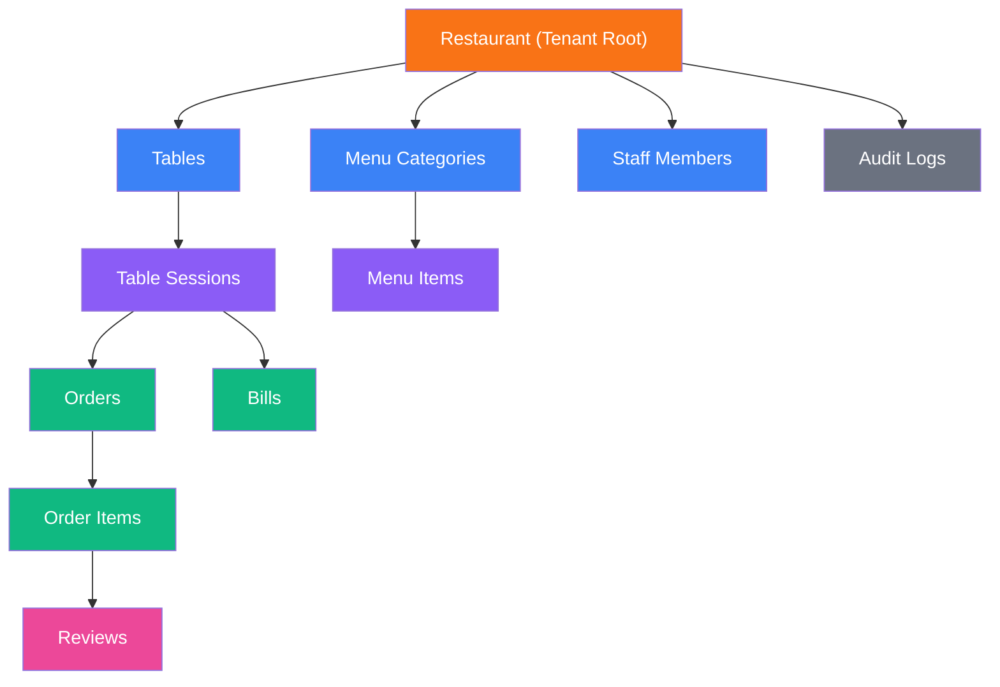

# FODQ — Entity Relationship Diagram

## Full ERD (Mermaid)

```mermaid
erDiagram
    users {
        UUID id PK
        VARCHAR email UK
        VARCHAR password_hash
        VARCHAR full_name
        VARCHAR phone UK
        BOOLEAN is_active
        BOOLEAN is_platform_admin
        TIMESTAMPTZ last_login_at
        INTEGER failed_login_count
        TIMESTAMPTZ locked_until
        TIMESTAMPTZ created_at
        TIMESTAMPTZ updated_at
    }

    restaurants {
        UUID id PK
        UUID owner_id FK
        VARCHAR name
        VARCHAR slug UK
        TEXT description
        VARCHAR logo_url
        TEXT address
        VARCHAR city
        VARCHAR state
        VARCHAR country
        VARCHAR phone
        VARCHAR email
        VARCHAR currency
        NUMERIC tax_rate
        NUMERIC service_charge_rate
        BOOLEAN is_active
        TIMESTAMPTZ created_at
        TIMESTAMPTZ updated_at
    }

    staff_members {
        UUID id PK
        UUID user_id FK
        UUID restaurant_id FK
        VARCHAR role
        BOOLEAN is_active
        TIMESTAMPTZ created_at
        TIMESTAMPTZ updated_at
    }

    tables {
        UUID id PK
        UUID restaurant_id FK
        VARCHAR table_number
        VARCHAR label
        INTEGER capacity
        VARCHAR qr_token UK
        BOOLEAN is_active
        TIMESTAMPTZ created_at
        TIMESTAMPTZ updated_at
    }

    table_sessions {
        UUID id PK
        UUID restaurant_id FK
        UUID table_id FK
        VARCHAR session_token UK
        VARCHAR status
        VARCHAR customer_phone
        TIMESTAMPTZ started_at
        TIMESTAMPTZ closed_at
        TIMESTAMPTZ expires_at
        TIMESTAMPTZ created_at
        TIMESTAMPTZ updated_at
    }

    menu_categories {
        UUID id PK
        UUID restaurant_id FK
        VARCHAR name
        TEXT description
        INTEGER sort_order
        BOOLEAN is_active
        TIMESTAMPTZ created_at
        TIMESTAMPTZ updated_at
    }

    menu_items {
        UUID id PK
        UUID restaurant_id FK
        UUID category_id FK
        VARCHAR name
        TEXT description
        NUMERIC price
        VARCHAR image_url
        INTEGER preparation_time
        BOOLEAN is_veg
        BOOLEAN is_available
        BOOLEAN is_recommended
        TEXT allergens
        TEXT dietary_info
        INTEGER sort_order
        BOOLEAN is_deleted
        TIMESTAMPTZ created_at
        TIMESTAMPTZ updated_at
    }

    orders {
        UUID id PK
        UUID restaurant_id FK
        UUID session_id FK
        UUID table_id FK
        INTEGER order_number
        VARCHAR status
        NUMERIC subtotal
        NUMERIC tax_amount
        NUMERIC discount_amount
        NUMERIC total
        VARCHAR idempotency_key UK
        TEXT special_instructions
        TIMESTAMPTZ placed_at
        TIMESTAMPTZ accepted_at
        TIMESTAMPTZ preparing_at
        TIMESTAMPTZ ready_at
        TIMESTAMPTZ served_at
        TIMESTAMPTZ cancelled_at
        TEXT cancellation_reason
        TIMESTAMPTZ created_at
        TIMESTAMPTZ updated_at
    }

    order_items {
        UUID id PK
        UUID order_id FK
        UUID menu_item_id FK
        VARCHAR item_name
        NUMERIC unit_price
        INTEGER quantity
        NUMERIC line_total
        TIMESTAMPTZ created_at
    }

    bills {
        UUID id PK
        UUID restaurant_id FK
        UUID session_id FK
        UUID table_id FK
        VARCHAR bill_number
        NUMERIC subtotal
        NUMERIC tax_amount
        NUMERIC discount_amount
        NUMERIC service_charge
        NUMERIC total
        VARCHAR payment_status
        VARCHAR payment_method
        TIMESTAMPTZ paid_at
        UUID confirmed_by FK
        VARCHAR idempotency_key UK
        TIMESTAMPTZ created_at
        TIMESTAMPTZ updated_at
    }

    reviews {
        UUID id PK
        UUID restaurant_id FK
        UUID menu_item_id FK
        UUID session_id FK
        UUID order_item_id FK
        INTEGER rating
        TEXT comment
        TIMESTAMPTZ created_at
    }

    audit_logs {
        UUID id PK
        UUID restaurant_id
        UUID user_id
        VARCHAR action
        VARCHAR entity_type
        UUID entity_id
        JSONB details
        VARCHAR ip_address
        TEXT user_agent
        TIMESTAMPTZ created_at
    }

    security_events {
        UUID id PK
        VARCHAR event_type
        VARCHAR severity
        UUID user_id
        UUID restaurant_id
        VARCHAR ip_address
        JSONB details
        TIMESTAMPTZ created_at
    }

    refresh_tokens {
        UUID id PK
        UUID user_id FK
        VARCHAR token_hash UK
        VARCHAR device_info
        VARCHAR ip_address
        TIMESTAMPTZ expires_at
        TIMESTAMPTZ revoked_at
        TIMESTAMPTZ created_at
    }

    users ||--o{ staff_members : "has roles"
    users ||--o{ restaurants : "owns"
    users ||--o{ refresh_tokens : "has tokens"
    restaurants ||--o{ staff_members : "has staff"
    restaurants ||--o{ tables : "has tables"
    restaurants ||--o{ menu_categories : "has categories"
    restaurants ||--o{ table_sessions : "has sessions"
    restaurants ||--o{ orders : "has orders"
    restaurants ||--o{ bills : "has bills"
    restaurants ||--o{ reviews : "has reviews"
    restaurants ||--o{ audit_logs : "has logs"
    tables ||--o{ table_sessions : "has sessions"
    table_sessions ||--o{ orders : "has orders"
    table_sessions ||--|| bills : "has bill"
    menu_categories ||--o{ menu_items : "contains items"
    menu_items ||--o{ order_items : "ordered as"
    menu_items ||--o{ reviews : "has reviews"
    orders ||--o{ order_items : "contains"
    order_items ||--o| reviews : "reviewed as"
    users ||--o{ bills : "confirmed by"
```

---

## Tenant Ownership Chain

All data flows through the restaurant tenant:

Every query that accesses tenant-specific data must include `restaurant_id` in its WHERE clause. The `restaurant_id` is always derived from the authenticated user's context, never from client-supplied parameters.
